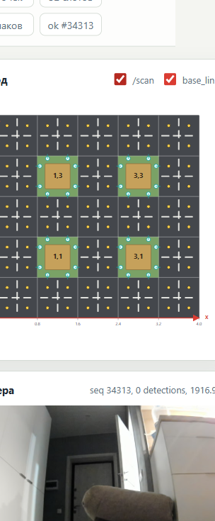
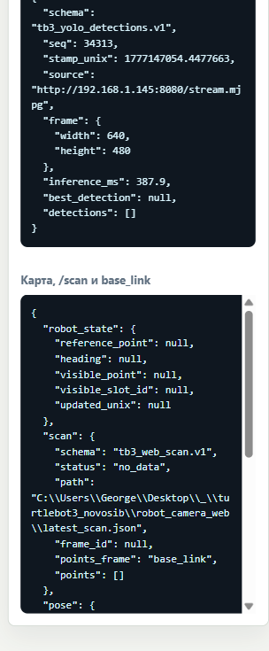
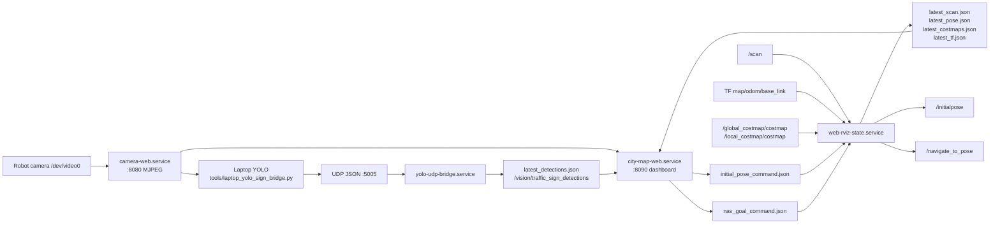

# TurtleBot3 Novosib City Web RViz

> A small robot-side web dashboard for the city-map task: camera, YOLO signs,
> reference points, Nav2 goals, `/scan`, costmaps, TF, and robot pose in one page.



## What Is Inside

This repository is a ROS 2 Jazzy workspace snapshot for the TurtleBot3 Burger
used in the Novosibirsk city-layout task.

Important pieces:

- `robot/camera_web/camera_web.py` - standalone MJPEG camera server on port `8080`.
- `robot/camera_web/city_map_web.py` - city-map dashboard on port `8090`.
- `src/tb3_camera_web` - ROS bridge nodes for YOLO JSON, web RViz telemetry,
  initial pose commands, and Nav2 goal commands.
- `src/tb3_rplidar_c1` - Cartographer and Nav2 launch/config for the RPLidar C1 setup.
- `src/scan_rectifier` - helper package for scan-frame experiments.
- `tools/laptop_yolo_sign_bridge.py` - laptop-side YOLO bridge that sends detections
  back to the robot over UDP.
- `systemd/` - services for camera, YOLO UDP bridge, web RViz bridge, and city dashboard.
- `scripts/` - robot installation/deploy helpers and Nav2 bringup/debug scripts.

## Current Web UI

Main dashboard:

```text
http://192.168.1.145:8090/
```

Camera-only UI:

```text
http://192.168.1.145:8080/
```

The dashboard is designed so the main controls fit on one desktop screen:

- simplified 4.0 x 4.0 m city map with 5 x 5 sections;
- blocked house sections at `(1,1)`, `(1,3)`, `(3,1)`, `(3,3)`;
- reference points every 0.4 m where the robot can drive;
- coordinate shift for the real start corner: course `(0.2, 0.2)` is map `(0.0, 0.0)`;
- empty sign slots at startup, filled as YOLO detections arrive;
- proxied live camera stream with detection overlay;
- `2D Pose Estimate` generator for AMCL initial pose;
- Nav2 goal generator: click/select a reference point, choose final yaw, preview JSON,
  then send to `/navigate_to_pose`;
- optional `/scan` and `base_link` overlays on the city map;
- lower diagnostic panels for costmaps, lidar, TF, robot pose, JSON, and tables.



## Architecture



## Dashboard Endpoints

City dashboard on `:8090`:

- `GET /` - full city-map Web RViz UI.
- `GET /map-data.json` - generated city map, reference points, sign slots, robot state.
- `GET /signs.json` / `POST /signs.json` - recognized sign memory.
- `GET /robot-state.json` / `POST /robot-state.json` - coarse reference-point state.
- `GET /detections.json` - YOLO detections proxied from the camera server.
- `GET /camera.mjpg` - proxied MJPEG camera stream.
- `GET /scan.json` - latest sampled lidar points.
- `GET /pose.json` - latest `base_link` pose in `map` or fallback frame.
- `GET /costmaps.json` - latest global/local costmaps.
- `GET /tf.json` - watched TF transforms.
- `GET /rviz-data.json` - combined scan, pose, costmap, TF, and Nav2 status.
- `GET /initial-pose.json` / `POST /initial-pose.json` - queue AMCL initial pose.
- `GET /nav-goal.json` / `POST /nav-goal.json` - queue Nav2 goal pose.

Camera server on `:8080`:

- `GET /stream.mjpg` - raw MJPEG stream.
- `GET /snapshot.jpg` - single JPEG frame.
- `GET /detections.json` - latest laptop YOLO result.
- `GET /healthz` - camera server health.

## Nav2 Notes

For map navigation, run one Nav2 stack at a time. Do not run Cartographer and AMCL
navigation together unless you intentionally want SLAM mode; both can publish map/TF
data and confuse the web dashboard and Nav2.

The checked-in `src/tb3_rplidar_c1/config/nav2_burger.yaml` is a conservative
Burger profile from robot-side testing:

- `bt_navigator.global_frame: map`;
- `map_server.yaml_filename: /home/ubuntu/maps/tb3_after_clean_restart.yaml`;
- DWB uses `RotateToGoal` and `GoalAlign` so the robot stops and turns at the goal;
- low velocity limits are set in both DWB and `velocity_smoother`;
- `collision_monitor` consumes `cmd_vel_smoothed` and publishes final `/cmd_vel`;
- planner tolerance is tightened for the small city map.

Before sending goals, publish or click `2D Pose Estimate` from the dashboard so AMCL
can create `map -> odom`. Without that transform, Nav2 will wait or reject goals.

## Install On Robot

Target robot used during development:

```text
host: 192.168.1.145
user: ubuntu
ROS: Jazzy
model: TurtleBot3 Burger
camera: /dev/video0
lidar: RPLidar C1
```

Clone/build on the robot:

```bash
cd /home/ubuntu
git clone https://github.com/GeBondar/turtlebot3_novosib.git turtlebot3_ws
cd /home/ubuntu/turtlebot3_ws
source /opt/ros/jazzy/setup.bash
colcon build --symlink-install
```

Install services:

```bash
cd /home/ubuntu/turtlebot3_ws
bash scripts/install_robot_services.sh
```

Or deploy just the city dashboard/ROS bridge from a Windows laptop:

```powershell
powershell -ExecutionPolicy Bypass -File scripts\deploy_city_web.ps1 `
  -Robot ubuntu@192.168.1.145
```

Check services:

```bash
systemctl status camera-web.service
systemctl status yolo-udp-bridge.service
systemctl status web-rviz-state.service
systemctl status city-map-web.service
curl http://127.0.0.1:8080/healthz
curl http://127.0.0.1:8090/map-data.json
```

## Run YOLO On Laptop

Install/use a Python environment with:

```bash
pip install ultralytics opencv-python torch
```

Run detection from the laptop:

```powershell
python tools\laptop_yolo_sign_bridge.py `
  --stream-url http://192.168.1.145:8080/stream.mjpg `
  --robot-host 192.168.1.145 `
  --robot-port 5005 `
  --max-fps 5
```

Useful flags:

```powershell
python tools\laptop_yolo_sign_bridge.py --max-fps 5 --show
python tools\laptop_yolo_sign_bridge.py --max-fps 5 --print-json
python tools\laptop_yolo_sign_bridge.py --model C:\path\to\best.pt
```

## Robot Bringup Helpers

The `scripts/tb3_nav` folder contains field-debug helpers that are copied to
`/home/ubuntu/tb3_nav` on the robot during experiments:

- `start_tb3_base.sh` - restart TurtleBot3 base bringup and publish a zero velocity.
- `start_tb3_map_nav.sh` - stop old Nav2/SLAM processes and start map Nav2.
- `start_tb3_slam_nav.sh` - start SLAM+Nav2 mode.
- `stop_tb3_nav_stack.sh` - stop Nav2, Cartographer, and RViz processes.
- `tb3_nav_status.sh` - compact process/topic/action status dump.
- `tb3_ros_env.sh` - shared ROS domain/model environment.
- `fastdds_no_shm.xml` - FastDDS profile that disables shared memory for short CLI commands.

## Development Notes

- The heavy YOLO model runs on the laptop, not on the robot.
- The robot webserver reads `/dev/video0` once and fans out MJPEG frames.
- Runtime JSON files live under `/home/ubuntu/camera_web` and are intentionally not
  committed.
- Keep `Cartographer` off while testing static-map Nav2 unless using `nav2_slam.launch.py`.
- If the web pose disappears, check TF first: `map -> odom`, `odom -> base_link`,
  `base_link -> base_scan`.
