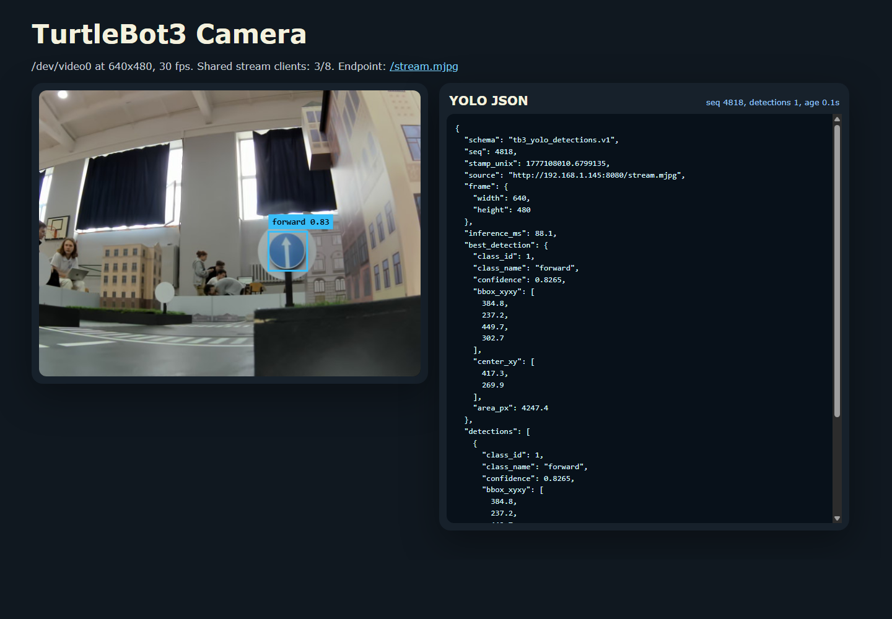
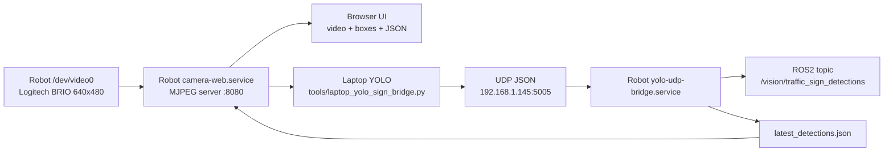

# TurtleBot3 Novosib Vision Stack

> Robot streams camera frames. Laptop runs YOLO. ROS2 gets clean JSON decisions.



## What Is Inside

This repository is a ROS2 Jazzy workspace snapshot plus the lightweight vision bridge we built for the robot.

The important pieces:

- `src/` contains the ROS2 packages from `/home/ubuntu/turtlebot3_ws/src` on the robot.
- `src/tb3_camera_web` contains ROS2 wrappers for the camera webserver and the YOLO UDP bridge.
- `robot/camera_web/camera_web.py` is the standalone MJPEG camera webserver.
- `tools/laptop_yolo_sign_bridge.py` runs YOLO on the laptop and sends JSON detections back to the robot.
- `systemd/` contains services for boot-time camera streaming and YOLO-result bridging.
- `docs/images/web-ui.png` shows the current web UI: live camera, YOLO JSON, and bounding boxes.
- `urdf_tools/` contains the local TurtleBot3 URDF helpers used during setup/debugging.

## Architecture



The heavy model never runs on the robot. The robot only streams MJPEG frames and republishes small JSON packets.

## Web UI

Open from any device in the local network:

```text
http://192.168.1.145:8080/
```

Useful endpoints:

- `GET /stream.mjpg` - raw MJPEG stream.
- `GET /snapshot.jpg` - one current JPEG frame.
- `GET /detections.json` - latest YOLO result from the laptop.
- `GET /healthz` - camera server health and stream client count.

If YOLO sees nothing, `detections` is empty and the page shows the camera image without bounding boxes.

## Install On Robot

Target robot used during development:

```text
host: 192.168.1.145
user: ubuntu
ROS: Jazzy
camera: /dev/video0
```

Clone this repo on the robot and build the ROS2 workspace:

```bash
cd /home/ubuntu
git clone <YOUR_GITHUB_REPO_URL> turtlebot3_ws
cd /home/ubuntu/turtlebot3_ws
source /opt/ros/jazzy/setup.bash
colcon build --symlink-install
```

Install the standalone webserver and systemd units:

```bash
mkdir -p /home/ubuntu/camera_web
cp robot/camera_web/camera_web.py /home/ubuntu/camera_web/camera_web.py
chmod +x /home/ubuntu/camera_web/camera_web.py

sudo cp systemd/camera-web.service /etc/systemd/system/camera-web.service
sudo cp systemd/yolo-udp-bridge.service /etc/systemd/system/yolo-udp-bridge.service
sudo systemctl daemon-reload
sudo systemctl enable --now camera-web.service
sudo systemctl enable --now yolo-udp-bridge.service
```

Check robot services:

```bash
systemctl status camera-web.service
systemctl status yolo-udp-bridge.service
curl http://127.0.0.1:8080/healthz
```

## Run YOLO On Laptop

Install/use a Python environment with:

```bash
pip install ultralytics opencv-python torch
```

Run detection from the laptop:

```powershell
python tools\laptop_yolo_sign_bridge.py `
  --stream-url http://192.168.1.145:8080/stream.mjpg `
  --robot-host 192.168.1.145 `
  --robot-port 5005 `
  --max-fps 5
```

Debug with a preview window:

```powershell
python tools\laptop_yolo_sign_bridge.py --max-fps 5 --show
```

Print full JSON locally:

```powershell
python tools\laptop_yolo_sign_bridge.py --max-fps 5 --print-json
```

The default model path in the laptop script is:

```text
C:\Users\George\Desktop\_\RTK_KUBOK_MOSCOW\gorod_znaki_01_04_2026\my_yolov8n_run\weights\best.pt
```

If the model lives elsewhere, pass:

```powershell
--model C:\path\to\best.pt
```

## ROS2 Output

The robot publishes laptop YOLO results here:

```bash
source /opt/ros/jazzy/setup.bash
source /home/ubuntu/turtlebot3_ws/install/setup.bash
ros2 topic echo /vision/traffic_sign_detections
```

Topic type:

```text
std_msgs/msg/String
```

The string is JSON:

```json
{
  "schema": "tb3_yolo_detections.v1",
  "seq": 4818,
  "stamp_unix": 1777108010.6799135,
  "source": "http://192.168.1.145:8080/stream.mjpg",
  "frame": { "width": 640, "height": 480 },
  "inference_ms": 88.1,
  "best_detection": {
    "class_id": 1,
    "class_name": "forward",
    "confidence": 0.8265,
    "bbox_xyxy": [384.8, 237.2, 449.7, 302.7],
    "center_xy": [417.3, 269.9],
    "area_px": 4247.4
  },
  "detections": []
}
```

## Common Commands

Restart camera webserver:

```bash
sudo systemctl restart camera-web.service
```

Restart YOLO UDP bridge:

```bash
sudo systemctl restart yolo-udp-bridge.service
```

Watch bridge logs:

```bash
journalctl -u yolo-udp-bridge.service -f
```

Watch camera logs:

```bash
journalctl -u camera-web.service -f
```

## Notes

- Do not run YOLO on the robot. It is intentionally a laptop-side process.
- The camera webserver supports multiple viewers by reading `/dev/video0` once and fan-out streaming the latest MJPEG frames.
- The web UI draws bounding boxes from `/detections.json`; if the JSON has no detections, no overlay is drawn.
- `src_export.tar.gz` is ignored and should not be committed.

